# codecheckドキュメンテーション
codecheckの組織向けドキュメンテーションにようこそ！

codecheckとは、実践的なプログラミング問題をオンラインエディタやGitHubと連携して問題を回答するプログラミング試験サービスです。

---

## チャレンジの閲覧

チャレンジは試験の設問として使われる、1-2時間程度で解ける、  
受験者の特定の能力を判定する問題です。  
チャレンジの閲覧・インポート・設定の変更は当メニューからできます。  
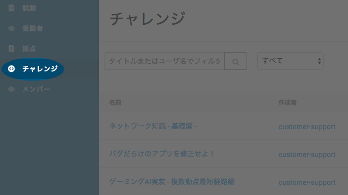

任意のチャレンジの名前をクリックしてチャレンジの問題文・難易度・所要事項等を確認することができます。  
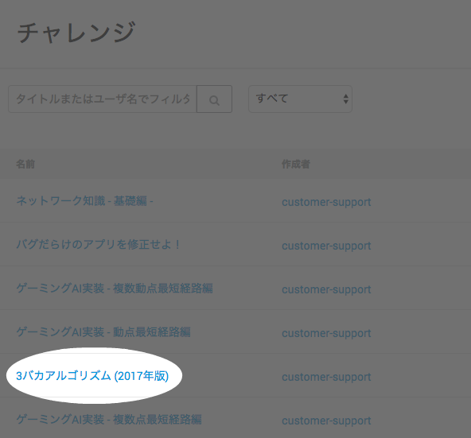

以下の通り説明文が表示されます。  
右上のプレビューボタンをクリックすると、受験者が実際に受験した際に利用するエディタ画面を確認することができます。
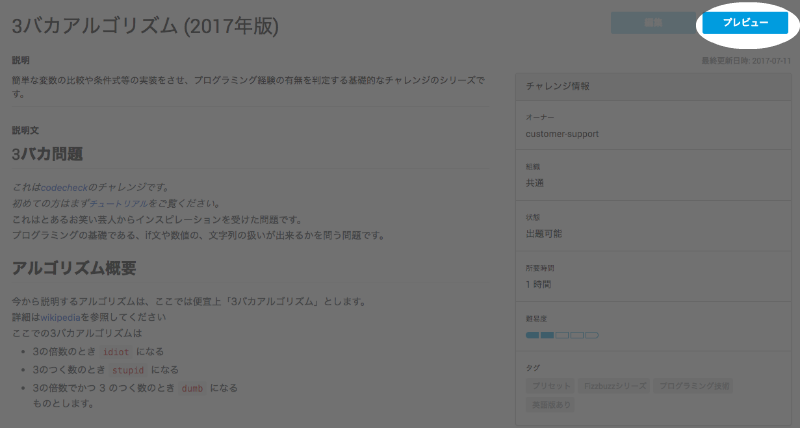

以下のようにエディタ内で選択したチャレンジを確認することができます。
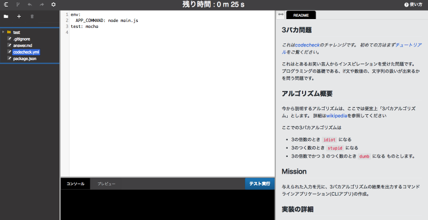
（なお、当プレビューモード内で編集は反映されません。  
試しに受験したい場合は自分のメールアドレスに試験を配信してみてください。）

---

## 試験の作成
試験は2-3チャレンジで構成され、  
応募要件に受験者の能力が達しているかが判定できるものです。  
試験の作成・設定・配信は当メニューからできます。  
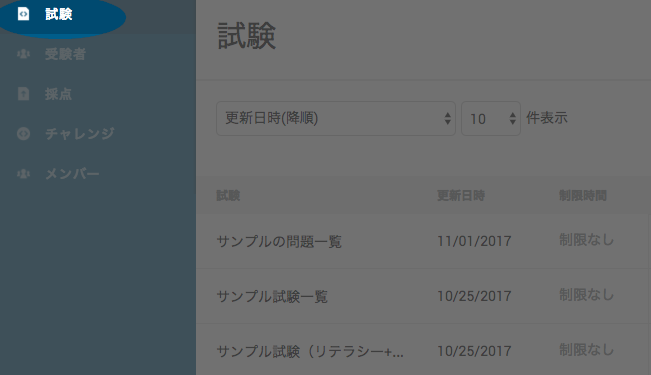

右上の「試験の作成」をクリックして試験の作成を開始できます。

受験者向けの任意の名前を記入します。  
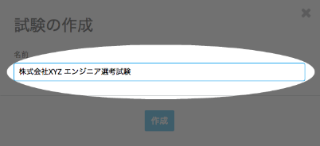

初めに、チャレンジ選択画面が表示されます。  
任意のチャレンジの「追加ボタン」をクリックしてください。  
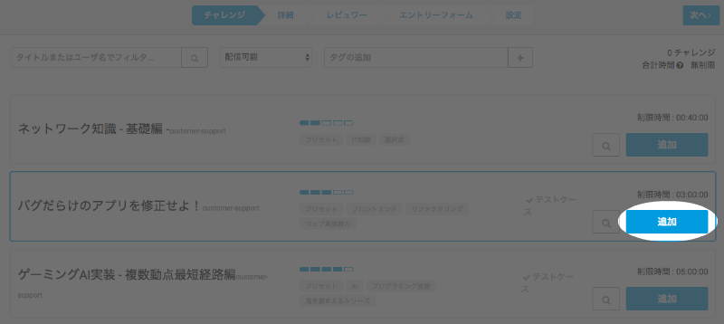

クリックしたチャレンジが選択した順番に表示されます。
「次へ」をクリックしてチャレンジ詳細文の記入に進みます。
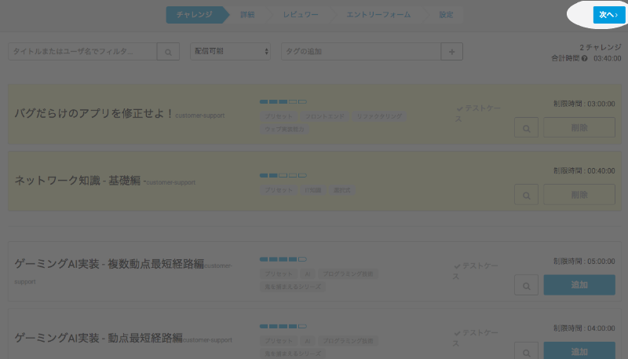

受験者に表示する試験の説明等を記入します。  
「詳細」項目のみ必須項目となっていますので、必ず記入ください。
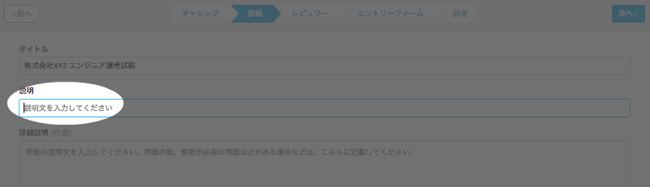
また、推奨している注意事項は[当サンプル試験](https://app.code-check.io/urlexams/25d21f95-1db7-4fd2-b783-dac3fc92af65)より確認できます。

「次へ」をクリックするとレビュワー選択画面に映ります。  
試験結果をレビューさせたいエンジニア等のユーザーを選択すると、  
後に各提出物にコメントや:+1:、:-1:を追加することができます。  
(また、レビュワーを選択せずに次に進むことも可能です。)
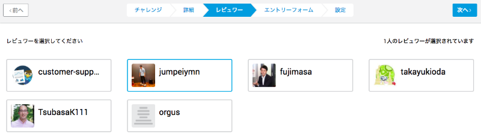

次にエントリーフォーム作成画面が表示されます。  
こちらは試験開始前に受験者から取得したい諸情報を入力させるエントリーフォームを自由に作成することができる画面です。
こちらも任意で追加できる機能です。  
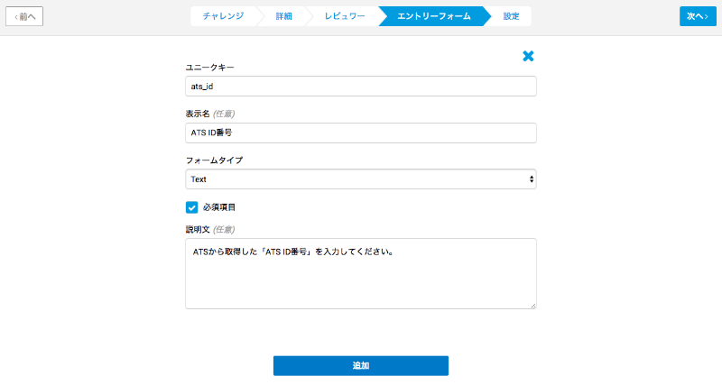
<!-- また、ATSとの連携をさせたい場合は、以下の「ATS連携推奨利用方法」をご覧ください。 -->

最後に設定画面が表示されます。  
一番頭の「チャレンジごとの制限時間」では受験者が各チャレンジを解くのに与えられる時間を制限することができます。  
空の場合、受験者は試験全体の提出期限までチャレンジを解答することができます。
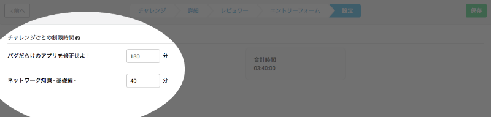

URL受験機能を利用すると、試験に独自のURL(ウェブアドレス)を付与し、  
URLを知っている誰もが受験できる公開式の試験を運用することが可能です。
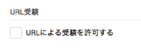  
チェックをすると、URLの公開期間を設定することが可能です。  
(既定値は試験作成時の翌日からの公開となっています。
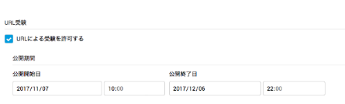

その他の設定を確認した後、  
右上の「保存」をクリックすることで試験の作成が完了します。
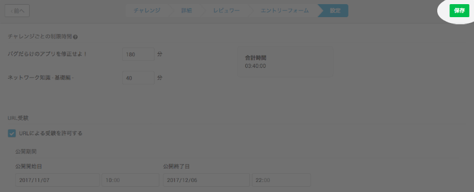

試験の作成が完了次第、下の試験概要ページが表示されます。  
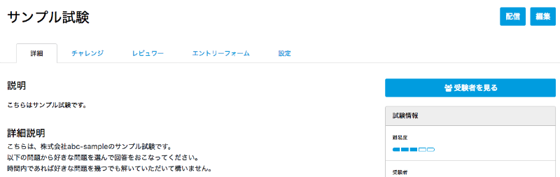  

---

## 試験の配信
codecheckでは特定の受験者にメールにて試験を配信することができます。
まず、試験一覧より配信したい試験の名前をクリックしして試験概要ページをアクセスします。
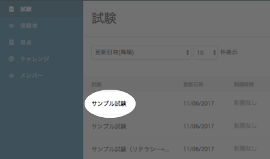

次に、右上の「配信」ボタンをクリックします。
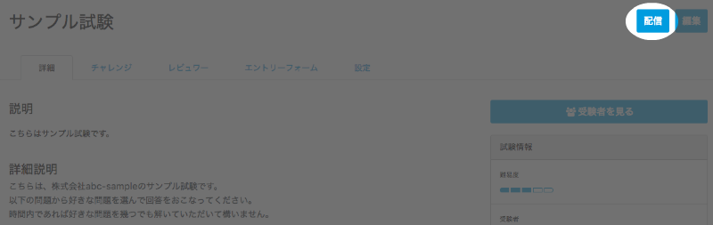

試験配信フォーム内に、任意の提出期限日時・題名・本文等を記入します。
メールアドレスはカンマ(`,`)で区切ることによって複数アドレスに配信することが可能です。
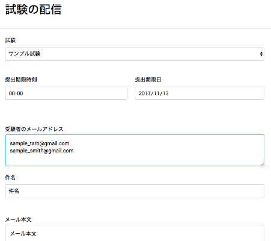

全ての項目が記入されたら、右上の「確認」ボタンをクリックします。  
確認画面で内容を再度確認後、「配信」ボタンをクリックして配信は完了します。
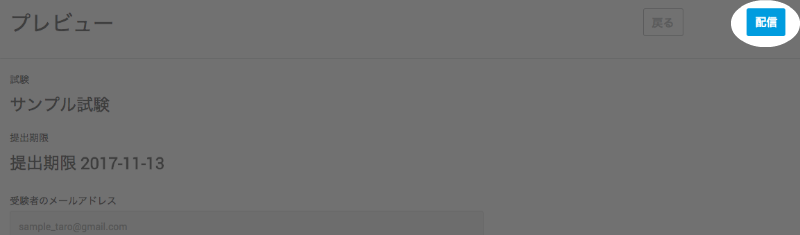

---

## 受験方法

受験方法については、[受験者向けのチュートリアル](https://code-check.github.io/docs/ja/get_started/)をご覧ください。

---

## 受験者一覧
受験者とは試験が配信されたユーザーです。  
受験者の状態・解答中のチャレンジの詳細・現在のテストケース点数は当メニューから確認できます。  
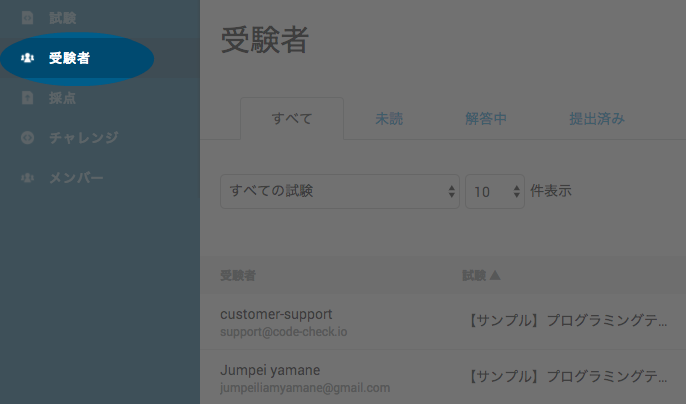

受験者の一覧を試験別に閲覧するには以下フィルターを利用ください。
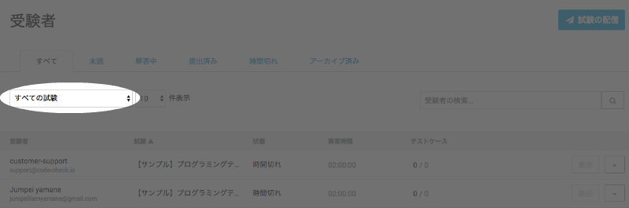

また、受験者のステータス別に閲覧することも以下タブより可能です。
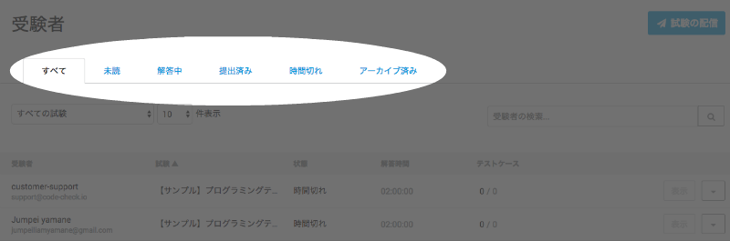
ステータスの説明は以下のとおりとなります：
- 未着手・未読: 試験を開始していない受験者
- 解答中:　試験を開始して、まだ提出・時間切れになっていない受験者
- 提出済み: 試験を提出した受験者
- 時間切れ: 試験を開始しないまま提出期限に到達した受験者
- アーカイブ済み: アーカイブ機能を利用してそれ以外のステータスから除外された古い受験者

さらに、各列の冒頭をクリックすることによって表示順を変えることが可能です。
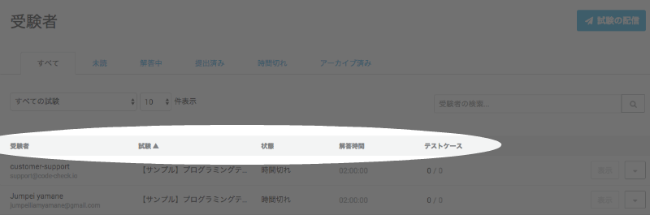

受験者の提出を確認するには、受験者一覧より該当する受験者の「表示」ボタンをクリックします。
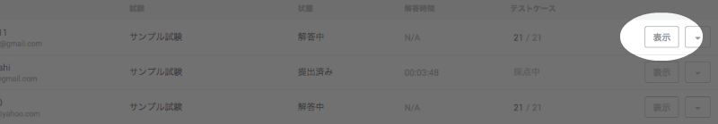

提出の詳細が表示されます。
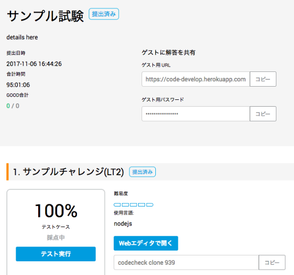

各チャレンジごとに、スコア及びテストケース件数(`成功件数 / テスト総数`)が表示されます。  
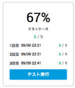  
codecheckでは、採点の誤りを回避するため、試験の提出後に最低３回採点処理を実行しています。  
この処理が完了した際に「採点済み」としています。  
ですので、選考の判断材料としては上の図のように最低３回採点処理が行われ、  
「採点済み」となるまでお待ちすることを推奨しております。

「Webエディタで開く」をクリックすると、受験者の提出したコードを実際に閲覧・実行することができます。
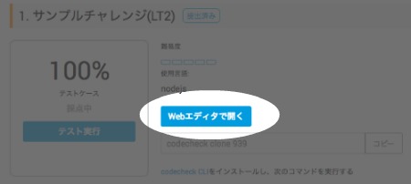

「採点の詳細」では、各チャレンジの採点項目（テスト内容）が表示され、各行が１点の配点となっています。
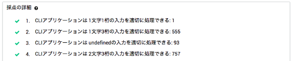

「解答の経過」は点数の変化を時系列上に折れ線グラフにしたものです。解答者の保存(もしくはgit push)毎に点を置いています。
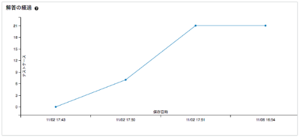

---

## 採点一覧
「採点」には受験者が提出した試験のみが表示されます。  
最終的な解答時間・テストケース点数等の提出済試験の詳細は当メニューから確認くださいください。  
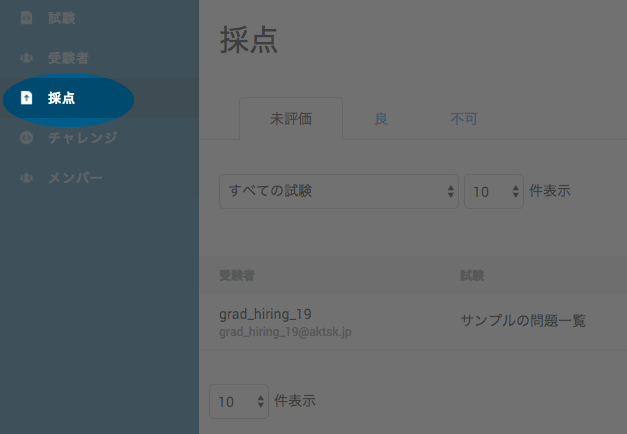
